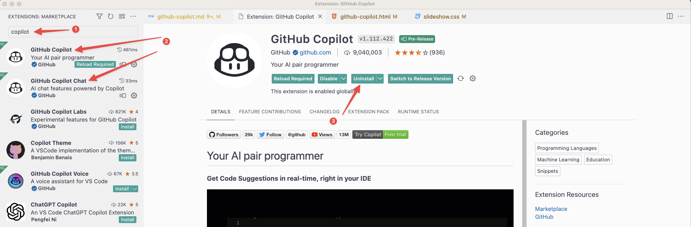
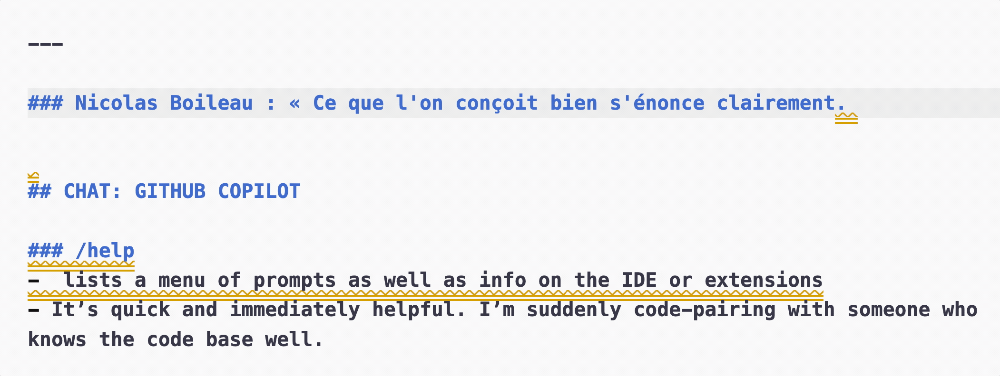
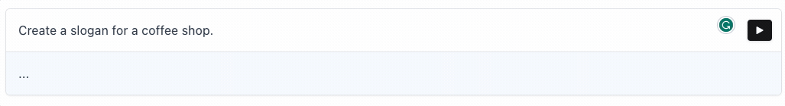
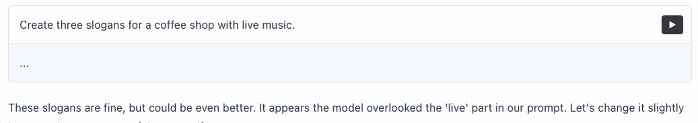
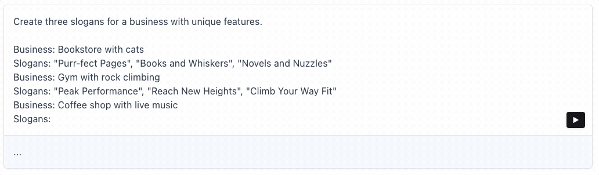
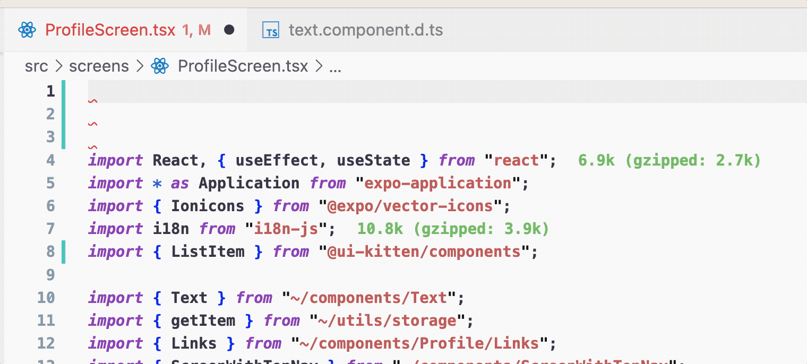
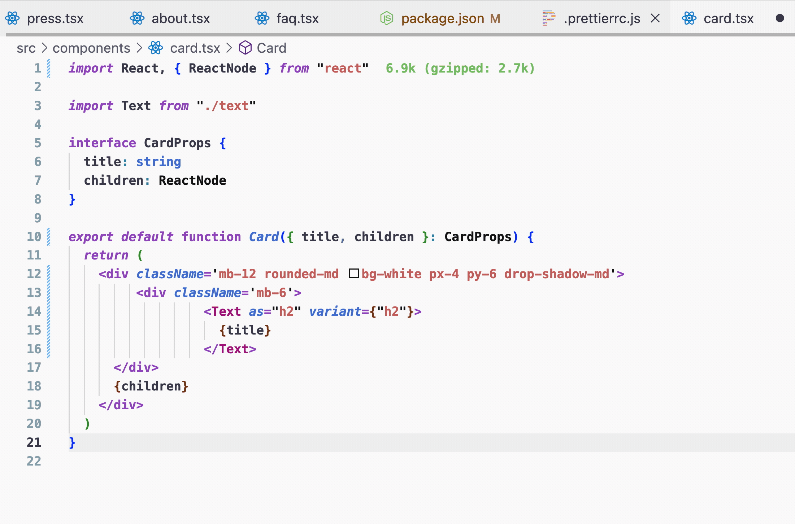
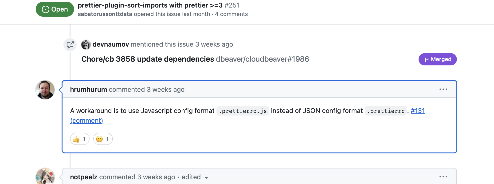

name: inverse
layout: true
class: center, middle, inverse

---

layout: false

# How to develop 55% faster with AI using VSCode and GitHub Copilot

📍 ChtiJS 27

🗓️ _December 2023_

<small style="font-size: 10px; opacity: 0.1;">`C` to clone a display; `P` to switch to presenter mode.</small>

---


???
I ask to ChatGPT who is the most powerfull xmen ?
You can answer in the chat.
it's Jean Grey.

---


???
I do not agree, for me it's Charles Xavier with cerebro.

---

> Using GitHub Copilot

--

> —it's like reading your mind

---

## `/whois`

--

### David Leuliette

.remark-avatar[]

--

- Freelance React Native Developer

--

- Artifical Intelligence certified by Infinite Red

--

📋 [davidl.fr/courses](https://davidl.fr/courses)

--

💬 [`@flexbox` on Slack](https://slack.com/intl/fr-fr/customer-stories/le-wagon-coding-bootcamps-scales)

--

🚀 [davidl.fr/onboarding](https://davidl.fr/onboarding)

???
Je suis disponible pour des missions freelance, ou bootcamp.

Sur le slack du wagon, je spam mes live twitch.

---

## Welcome


???
a small recap to have the same level of knowledge

---

### What is `git`?

--

- 📜 a tool to manage your source code history.

--

- 🔄 a distributed version control system.

--

- 🗓️ initial release 2005.

--


???
Linus Torvalds is the creator of the Linux kernel and the Git version control system.

---

### What is `git`?


---

### What is `git`?


---

### What is GitHub?

--

- 👷 the website where developers build software.

--

- 🏡 the home for open source projects.

--

- 🗓️ initial release 2008.

---

### What is GitHub?


---

### What is GitHub?


???
The world’s leading AI-powered developer platform.

---

### What is GitHub Copilot?

--

- 👯 AI pair programmer that helps you write better code.

--

- 🦾 27,000 organizations and over 1.5 million developers are using GitHub Copilot.

--

- 🗓️ initial release 2021.

--

Coding [55% faster with GitHub Copilot](https://youtu.be/NrQkdDVupQE?si=aG8_ULSTasvCBvGg&t=237)


???
Codex model is trained on a selection of public source code from GitHub, a corpus of English text from public sources on the internet, and a small selection of English language source code comments.

ChatGPT is model trained on a selection of public conversations from the internet, including public domain books, movie scripts, and other public domain sources.

---

## [Getting Started](https://docs.github.com/en/copilot/getting-started-with-github-copilot)


---

### 1. Install extensions

--



--

- [GitHub.copilot](https://marketplace.visualstudio.com/items?itemName=GitHub.copilot)

--

- [GitHub.copilot-chat](https://marketplace.visualstudio.com/items?itemName=GitHub.copilot-chat)

--

- [cursor.so](https://www.cursor.so) VSCode fork with openAI integrated

---

### 2. Create a new file

--

- write a function name `getMyPosition`

--

- Have the autocomplete

--

- don't forget to choose the file format

---

### 2. Create a `JavaScript` function


---

### 2. Create a `ruby` function


---

### 3. Write a comment

<script src="https://player.vimeo.com/api/player.js"></script>

<div style="padding:62.5% 0 0 0;position:relative;"><iframe src="https://player.vimeo.com/video/866339740?badge=0&amp;autopause=0&amp;player_id=0&amp;app_id=58479" frameborder="0" allow="autoplay; fullscreen; picture-in-picture" style="position:absolute;top:0;left:0;width:100%;height:100%;" title="create-a-function-with-comments"></iframe></div>

---

> Nicolas Boileau — 1636 / 1711

--

> « Ce que l'on conçoit bien s'énonce clairement. » <br />

--



???
The invention of print though us how to read.
AI will teach us how to write.

---

### Writing a sentence 101


---

<iframe src="https://www.youtube.com/embed/QiXJtjNea1A?modestbranding=1&showinfo=0&rel=0&iv_load_policy=3&theme=light&fs=0&color=white&controls=0&disablekb=1" width="760" height="515"  frameborder="0"></iframe>

---

### [prompt engineering](https://sdk.vercel.ai/docs/concepts/prompt-engineering)

???
"Prompt engineering" is like giving instructions to a robot.

You tell the robot what you want it to do, and it will do it for you. But sometimes, the robot doesn't understand exactly what you mean, so you have to give it more specific instructions.

--



---

### [prompt engineering](https://sdk.vercel.ai/docs/concepts/prompt-engineering)


---

### [prompt engineering](https://sdk.vercel.ai/docs/concepts/prompt-engineering)



---

### [prompt engineering](https://sdk.vercel.ai/docs/concepts/prompt-engineering)



???
That's what "prompt engineering" is - making sure the robot understands exactly what you want it to do.

---

### Vercel AI playground

[sdk.vercel.ai](https://sdk.vercel.ai/)

???

- add `text-da-vinci`

1. who is the most powerful X-Men?
1. Output data as a table with 3 columns name, ability and age
1. create another table for villains with the same columns

---

## GitHub Copilot features

--

1. Write a comment describing the logic you want.

--

2. Shares recommendations based on the project's context and style conventions.

- ✅ accept
- ❌ reject

???
Trained on billions of lines of code, GitHub Copilot turns natural language prompts into coding suggestions across dozens of languages.

https://github.com/features/copilot

---

### Ask basic questions

--

1. write a comment with `// q:`

--

2. get the anwswer with `// a:`



???
it's great but we can't ask complex questions like "how to do a login with supabase?"

---

## GitHub Copilot Chat

DEMO

???

Open VSCode and:

1. Open the chat in a sidebar
1. Open the chat in a editor tab

---

### `/help`

--

- lists a menu of prompts as well as info on the IDE or extensions

---

### `/explain`

--

- will explain the open or highlighted code

---

### `/explain`

<div style="padding:75% 0 0 0;position:relative;"><iframe src="https://player.vimeo.com/video/868347163?badge=0&amp;autopause=0&amp;player_id=0&amp;app_id=58479" frameborder="0" allow="autoplay; fullscreen; picture-in-picture" style="position:absolute;top:0;left:0;width:100%;height:100%;" title="explain-add-comments"></iframe></div>

???

- explain
- add more comments and make the code more readable
- separate code into functions

---

### `/doc`

--

1. Highlight code

--

1. Right click > Copilot > Doc

---

### `/doc`

<div style="padding:75% 0 0 0;position:relative;"><iframe src="https://player.vimeo.com/video/868352583?badge=0&amp;autopause=0&amp;player_id=0&amp;app_id=58479" frameborder="0" allow="autoplay; fullscreen; picture-in-picture" style="position:absolute;top:0;left:0;width:100%;height:100%;" title="docs"></iframe></div>

???

- cool feature hilight and check

pause on zoom

---

### `/fix`

--

- will provide solutions for problems in the open or highlighted code

---

### `/fix`

<div style="padding:75% 0 0 0;position:relative;"><iframe src="https://player.vimeo.com/video/868368028?badge=0&amp;autopause=0&amp;player_id=0&amp;app_id=58479" frameborder="0" allow="autoplay; fullscreen; picture-in-picture" style="position:absolute;top:0;left:0;width:100%;height:100%;" title="fix"></iframe></div>

---

### `/tests`

--

- automatically write tests

---

### `/tests`

<div style="padding:75% 0 0 0;position:relative;"><iframe src="https://player.vimeo.com/video/866343632?badge=0&amp;autopause=0&amp;player_id=0&amp;app_id=58479" frameborder="0" allow="autoplay; fullscreen; picture-in-picture" style="position:absolute;top:0;left:0;width:100%;height:100%;" title="create-unit-tests"></iframe></div>

???
write set of units tests

---

## Transform x into y

--

- Prettier

--



---

## Transform x into y

- [`prettier-plugin-sort-imports`](https://github.com/trivago/prettier-plugin-sort-imports/issues/251#issuecomment-1710559245)


---

## Transform x into y



---

## Transform x into y

<div style="padding:75% 0 0 0;position:relative;"><iframe src="https://player.vimeo.com/video/868888653?badge=0&amp;autopause=0&amp;player_id=0&amp;app_id=58479" frameborder="0" allow="autoplay; fullscreen; picture-in-picture" style="position:absolute;top:0;left:0;width:100%;height:100%;" title="transform-x-to-y"></iframe></div>

???
before i would use an online tool to convert
but now i can stay into the zone and do it directly in my editor

---

## Generate code from selected text

--

<div style="padding:62.5% 0 0 0;position:relative;"><iframe src="https://player.vimeo.com/video/867316196?badge=0&amp;autopause=0&amp;player_id=0&amp;app_id=58479" frameborder="0" allow="autoplay; fullscreen; picture-in-picture" style="position:absolute;top:0;left:0;width:100%;height:100%;" title="generate-custom-hook"></iframe></div>

---

### focus mode **⌘** + I

<div style="padding:75% 0 0 0;position:relative;"><iframe src="https://player.vimeo.com/video/867309459?badge=0&amp;autopause=0&amp;player_id=0&amp;app_id=58479" frameborder="0" allow="autoplay; fullscreen; picture-in-picture" style="position:absolute;top:0;left:0;width:100%;height:100%;" title="extract-data-as-json"></iframe></div>

???
I have set **⌘** + J to align with NotionAI otherwise it drives me crazy

---

### Translation i18n

<div style="padding:75% 0 0 0;position:relative;"><iframe src="https://player.vimeo.com/video/868902304?badge=0&amp;autopause=0&amp;player_id=0&amp;app_id=58479" frameborder="0" allow="autoplay; fullscreen; picture-in-picture" style="position:absolute;top:0;left:0;width:100%;height:100%;" title="i18n"></iframe></div>

---

### Scope

```
@workspace
```

???
open VSCode in a folder
where is login handled? // does not work
@workspace where is login handled? // its working

---

### Scope

```
@terminal
```

---

## Learning new stuff

--

- `/explain` include comments inline

--

- what is x in y?

--

- give me an example of x

???

- what is a FlatList in react native?
- can you give me an example of a FlatList?

---

## Hacking job interview

???
what is the event loop in JavaScript?

---

## What's next?

---

### Hire a team of robots

--

[githubnext.com/projects/copilot-for-pull-requests](https://githubnext.com/projects/copilot-for-pull-requests)

[copilot4prs.githubnext.com/login](https://copilot4prs.githubnext.com/login)

---

### Automate your LinkedIn

--

[davidl.fr/blog/github-linkedin-chatgpt](https://davidl.fr/blog/github-linkedin-chatgpt)

---

## Q&A [@flexbox\_](https://twitter.com/flexbox_)

--

📕 https://flexbox.gumroad.com/l/road-react-native/HELLO_FRIEND


--

### In this talk, what parts were **the hardest to understand**?

???
coupon code HELLO_FRIEND -15%
