name: inverse
layout: true
class: center, middle, inverse

---

layout: false

# Job Seeking on Autopilot

IUT Calais

_January 2023_

---

## Why ?

- 🎓 Landing your first job is hard

---

background-image: url(./images/freelance/reality-vs-expectation.jpg)
background-size: contain

## HR Expectation Vs. Reality

---

background-image: url(./images/freelance/hacking-job-seeking.png)
background-size: contain

---

## [job-hunt-automation](https://flexbox.gumroad.com/l/job-hunt-automation/HELLO_FRIEND)

.left[]

---

## /whois

#### David Leuliette <small>aka</small> [@flexbox\_](https://twitter.com/flexbox_)

.remark-avatar[]

CEO [weshipit.today](https://weshipit.today/)

---

## Automation wizard

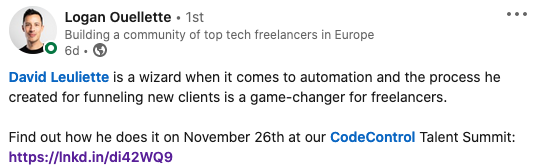

---

# Mentions ❤️ [@flexbox\_](https://twitter.com/flexbox_)

Save the link

https://davidl.fr/courses

---

## Why ?

- 🎓 Landing your first job is hard
- 🤖 Using **Growth Hack techniques**

---

template: inverse

> [Growth hacking](https://en.wikipedia.org/wiki/Growth_hacking) refers to the use of creative, data-driven and often low-cost techniques to quickly grow a business, product, or user base. It's a philosophy that prioritizes rapid experimentation and growth above all else.

---

### Growth Hack Example

--

- Send an email to the CTO asking for advice on how to apply for a job in company xyz

--

- Ask to a company to write a guest blog article

--

- PS I Love You — _hotmail.com 1990's_

???

ask to the audience example

- NordVPN generous free tiers

---

## Linkedin Secret

Talent managers don't know how to read

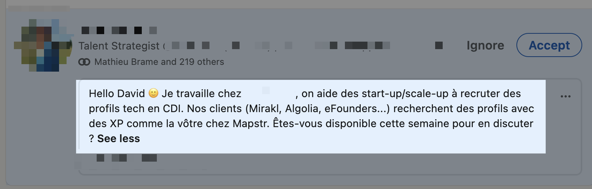

[https://www.linkedin.com/in/david-leuliette/](https://www.linkedin.com/in/david-leuliette/)

---

## Linkedin Secret

Digital talent manager don't know how to schedule


---

### Let’s automate onboarding!


---

background-image: url(./images/freelance/bottom-trawling.png)
background-size: contain

???
Bottom Trawling funnel

---

background-image: url(./images/freelance/aaarr-funnel-job.png)
background-size: contain

???

Growth Hacking AAARR funnel

---

# Today, we will cover:

1. A landing page that **wins you leads**
1. [**Airtable**](https://airtable.com/invite/r/C9rp2zWJ) as a database
1. **Collecting data** using IKEA technique
1. **Marketing Automation**
1. Land a job in a startup
1. Q&A

---

## Step 1: The landing page

---

### Create a relevant and impactful speech:

- **Why?** _Why did you create this service to help customers in their life?_
- **How?** _Are you the right person?_
- **What?** _The product/service you are selling_
- **Call to action** _with something valuable —like a free consultation_

---

background-image: url(./images/freelance/landing.jpg)
background-size: contain

---

### Create a relevant and impactful speech

- Demo: https://davidl.fr
- have a call to action to https://davidl.fr/onboarding

---

### A new job opportunity

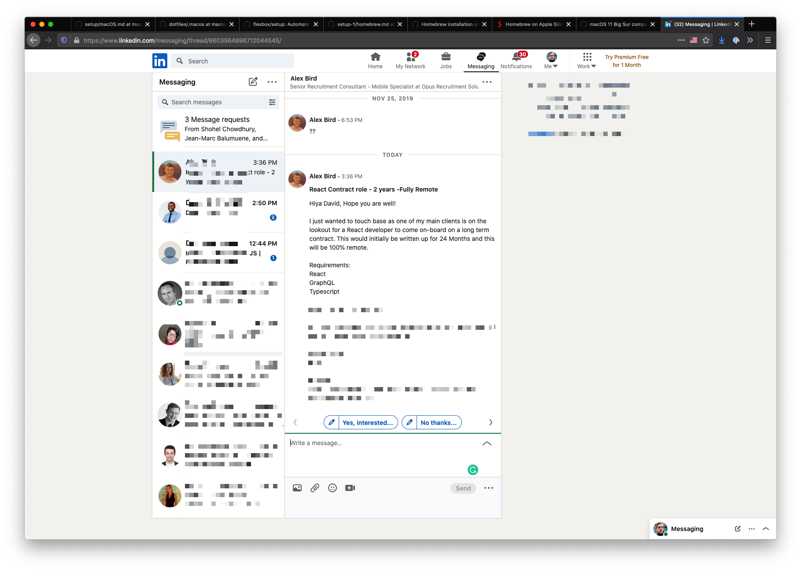

---

My template

```
Hello {name},

Thank you for contacting me. I am working remotely as a freelance developer.

In terms of timeline, I am currently accepting new projects for {current_date + 3 month}.

If you want to keep in contact, I created a small website for our next collaboration.
https://davidl.fr/onboarding

You will be the first informed when I’m available again.

Hoping to hear from you,
```

---

✅ **A landing page for new leads**

---

## Step 2: Airtable as a backend / database / CRM

---

### A spreadsheet on steroïd

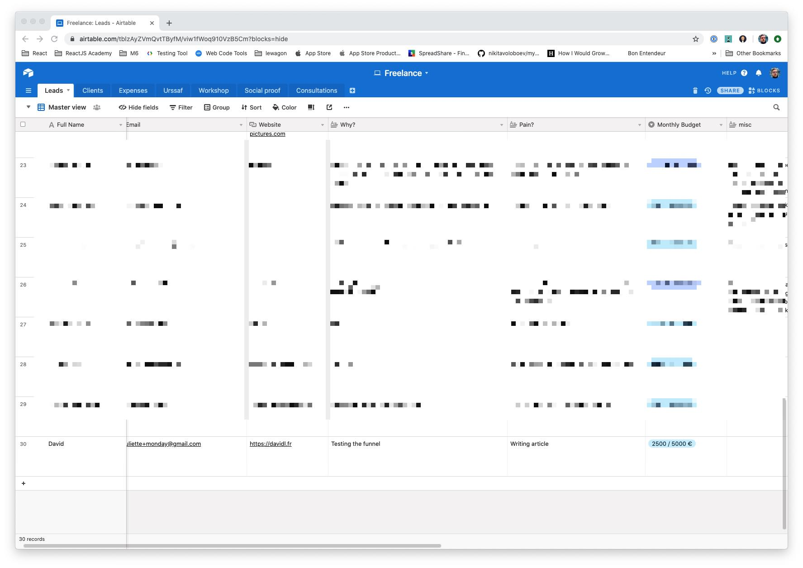

---

## …but I use Google Sheets

🤔

---

template: inverse

> A spreadsheet is a computer application for computation, organization, analysis and storage of data in tabular form. Spreadsheets were developed as computerized analogs of paper **accounting worksheets**.
> —wikipedia

---

### [Create a new account on airtable](https://airtable.com/invite/r/C9rp2zWJ)

---

### Create a new empty base

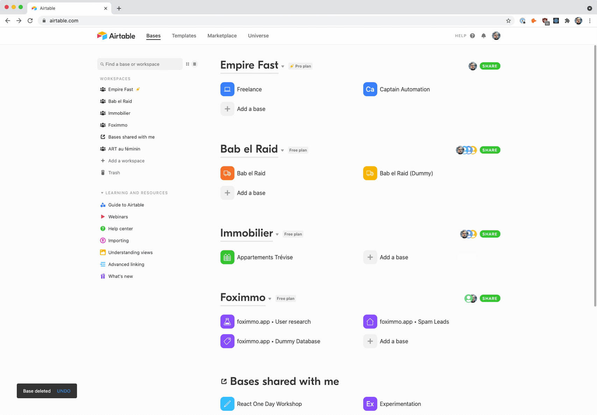

---

### Create a new empty base

- `fullname`
- `email`
- `website`
- `contact_reason`
- `created_date`

---

## Data Types are important

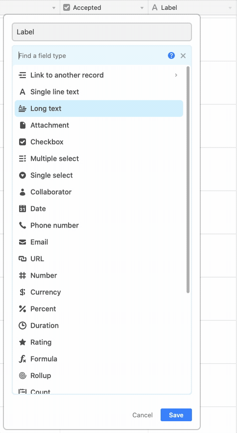

---

- ✅ A landing page for new leads
- ✅ **A single source of truth for the datas**

---

## Step3: Collect leads with a form

---

### Create a new form view


---

### 💥 A form in a second

I added an `iframe` on https://davidl.fr/onboarding

---

- ✅ A landing page for new leads
- ✅ A single source of truth for the datas
- ✅ **A way to ask questions**

---

<iframe src="https://www.youtube.com/embed/QiXJtjNea1A?modestbranding=1&showinfo=0&rel=0&iv_load_policy=3&theme=light&fs=0&color=white&controls=0&disablekb=1" width="760" height="515"  frameborder="0"></iframe>

---

## Step4: Plumbing

---

### During the week

I am working on my client's projects.


---

### I need to automate the follow-ups

👨‍💼

---

### Sending emails with Airtable?

📬

_For simple funnels_

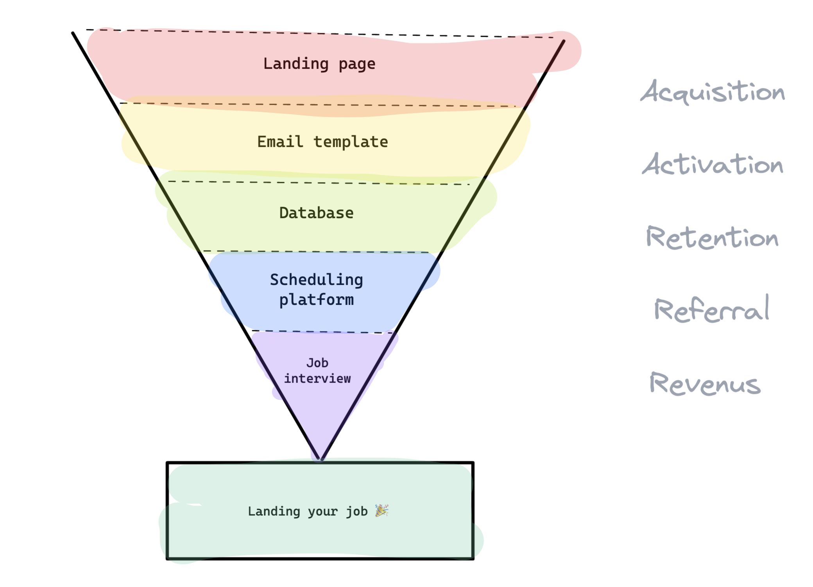

---

background-image: url(./images/freelance/airtable-automation-1.png)
background-size: contain

---

background-image: url(./images/freelance/airtable-automation-2.png)
background-size: contain

---

background-image: url(./images/freelance/airtable-automation-3.png)
background-size: contain

---

background-image: url(./images/freelance/airtable-automation-4.png)
background-size: contain

---

background-image: url(./images/freelance/airtable-automation-5.png)
background-size: contain

---

### Sending emails with Mailchimp?

🐵

_For advanced funnels_

---

### Introducing Zapier

👨‍🔧

---

### Introducing Zapier


---

### Add Airtable email to Mailchimp


---

You can copy my zap workflow: [Freelancing Sales Funnel with this link](https://zapier.com/shared/e8615b6c3b4522ab311c896d90a9515929dff98b).

---

When a new lead completes the Airtable form…

…the email is available on Mailchimp


---

- ✅ A landing page for new leads
- ✅ A single source of truth for the datas
- ✅ A way to ask questions
- ✅ **An emailing platform**

---

## Step5: Marketing automation

---

### Email nurturing


---

### Design your emails template

- ✉️ Email 1: Introduction
- ✉️ Email 2: Link to calendar
- ✉️ Email 3: Follow-up

---

### Airtable markdown preview

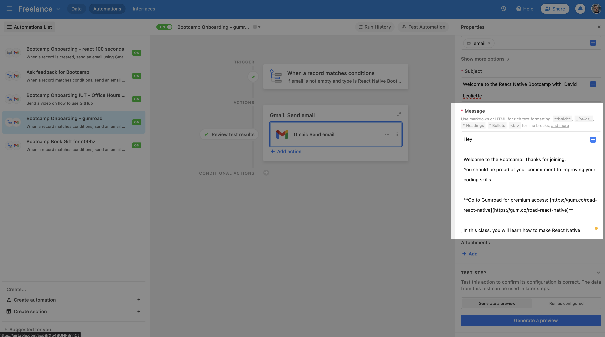

---

### Plain emails save time and work better


---

### Email 2: follow-up

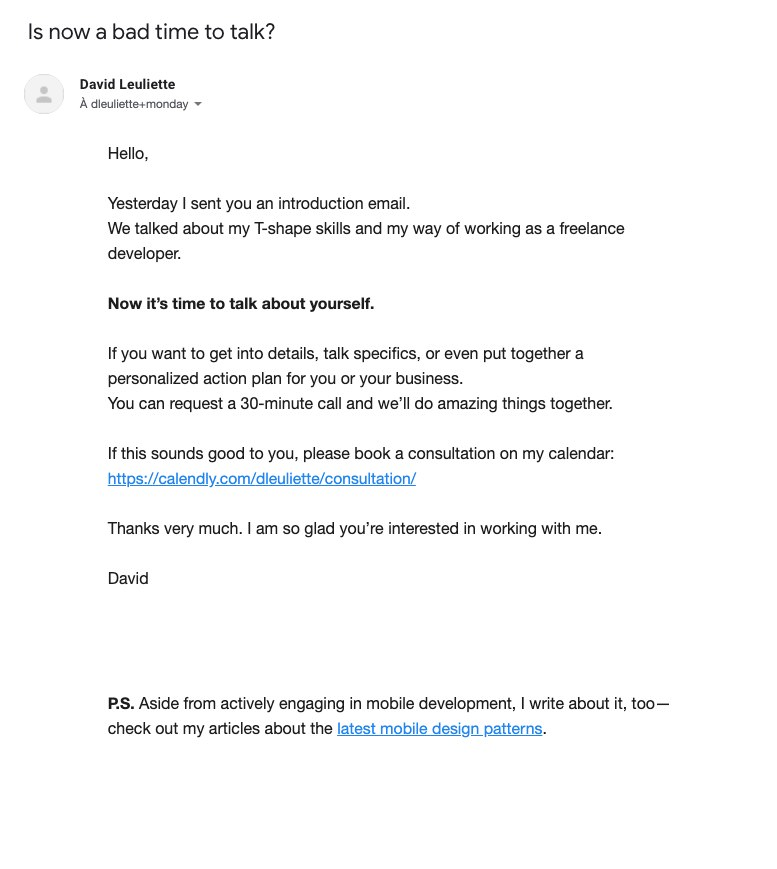

---

### Create your sales funnel

- ✉️ Trigger: Immediately
- ✉️ Trigger: 1 day after the previous email
- ✉️ Trigger: 2 days after, subscribers didn't open the previous email

---

### Mailchimp Automated campaign


---

- ✅ A landing page for new leads
- ✅ A single source of truth for the datas
- ✅ A way to ask questions
- ✅ An emailing platform
- ✅ **A sales funnel**

---

## Step6: Robot assistant

---

### Scheduling is hard


---

### Avoild the feedback loop of hell


---

### Use cal.com for consultations

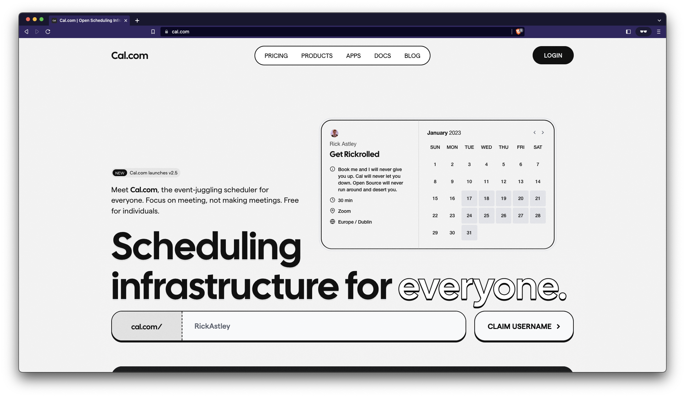

---

### Use cal.com for consultations

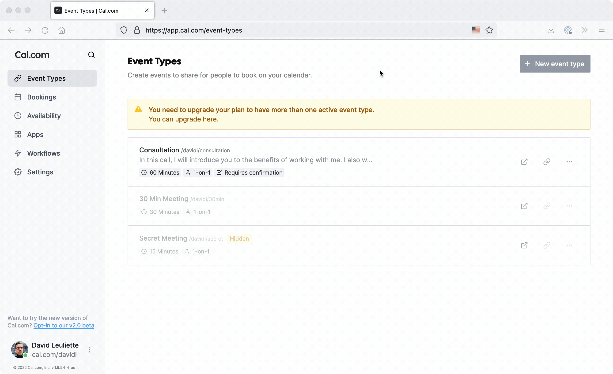

---

## Video call

We want a simple tool

- ✅ **No Download**
- ✅ 1to4 conversation
- ✅ Screen Sharing

---

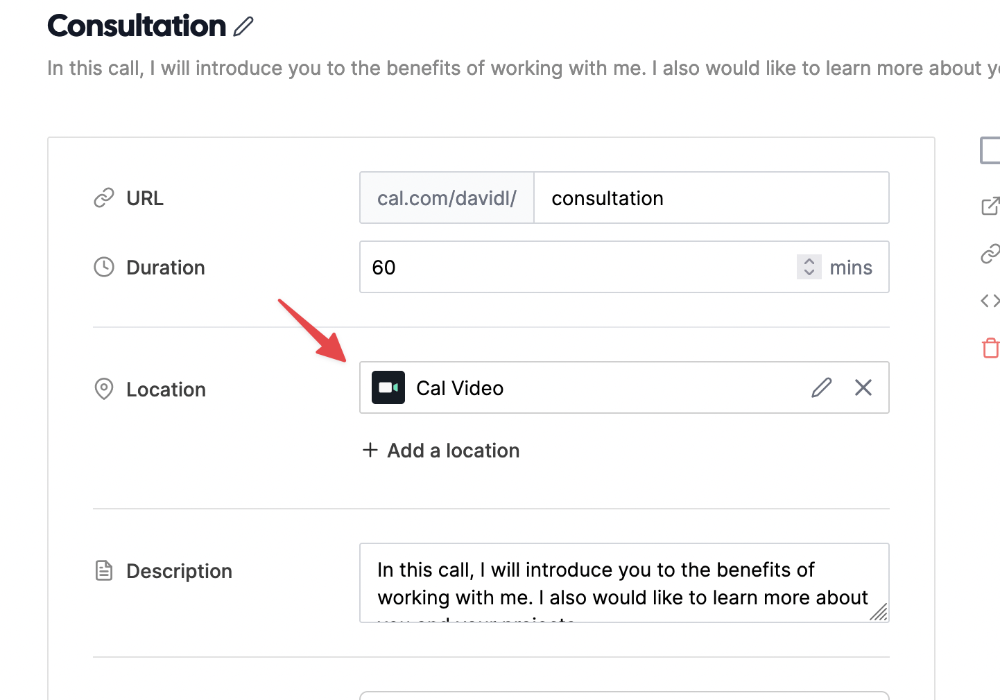

---

### Protip: ask the phone as a fallback

☎️

---

### DEMO

https://davidl.fr/consultation

---

- ✅ A landing page for new leads
- ✅ A single source of truth for the datas
- ✅ A way to ask questions
- ✅ An emailing platform
- ✅ A sales funnel
- ✅ **A calendar to book event**
- ✅ **One friction free place to have a video chat**

---

## Recap

---

- **1 landing page** with a simple url
- **Airtable** as a database / CRM
- **Zapier** to connect data to different services
- **Mailchimp** automated email sales funnel
- **cal.com** as robot assistant
- **cal.com** for the video call

---


---

# LinkedIn Growth Hack #45

```javascript
document.querySelectorAll('*[aria-label^="Invite"]').forEach((a) => {
  setTimeout(
    () => {
      console.log('✅ ' + a.getAttribute('aria-label'));
      a.click();
    },
    Math.floor(Math.random() * 15000),
  );
});
```

---

# LinkedIn Growth Hack #86

### Featured Skills & Endorsements

- Asked to the audience to give stars to their right neighbour.
- Repeat this 10 times.
- After 30 minutes, everyone in the room have great featured skills.

---

# How to land a job in a startup?

---

[welcometothejungle.com](https://www.welcometothejungle.com/fr/jobs?page=1&groupBy=job&sortBy=mostRelevant&query=react%20native)

---

## Step1: [Create a table on airtable](https://airtable.com/invite/r/C9rp2zWJ)

- firstname
- lastname
- email
- icebreaker

---

## Step2: feed database

- get email with: https://hunter.io
- get email with: https://datagma.com

???

icebreaker: J'ai vu ton post sur LinkedIn et

---

## Step3: hook email

### Objet

futur developer pour {company}

### Contenu

```markdown
Bonjour {prenom},

J'ai vu ton offre sur welcome to the jungle pour un poste de dev React Native et je suis interessé

{icebreaker}

J'adorerai en discuter avec toi au plus vite!

Je suis disponible pour un rendez-vous, voici mes disponibilité https://davidl.fr/consultation

À très vite!

Bien à toi

David

PS: voici le lien de mon profil GitHub https://github.com/flexbox
```

---

# Faire des relance

---

# Faire des relances, à chaque fois

---

# Faire des relances, à chaque fois, jusqu'à ce qu'on vous dise non

---

# Faire des relances, à chaque fois, jusqu'à ce qu'on vous dise non, comme ça vous pouvez demander une recommandation de 3 personnes à contacter

---

## Follow-up J+4

```markdown
Bonjour {prenom},

Je ne sais pas si tu avais reçu mon précédent mail concernant
le poste de dev react native que vous recrutez.

Je suis super motivé et j'adorerai pouvoir échanger avec toi!

J'ai pleins de questions à vous poser!

À très vite

David
```

---

## Q&A [@flexbox\_](https://twitter.com/flexbox_)

In this talk, what parts were the hardest to understand?

_Discount code `HELLO_FRIEND`_ for [https://gum.co/job-hunt-automation](https://flexbox.gumroad.com/l/job-hunt-automation/HELLO_FRIEND)


