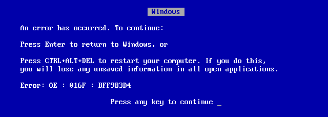
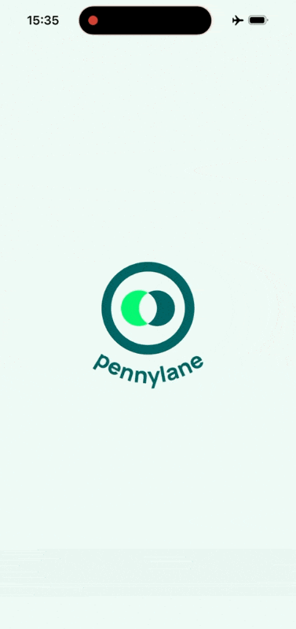

name: inverse
layout: true
class: center, middle, inverse

---

layout: false

# Offline First Mobile Apps

## with React Native & LegendState

📍 react nativeCon 3 - Berlin

🗓️ _8 October 2026_

<small class="text-hint">`C` to clone a display; `P` to switch to presenter mode.</small>

???
Guten Tag. 20 minutes. One idea: the device owns the truth.

---

class: center, bsod

# Who remembers this?

--

### The Blue Screen of Death

.crash-shot[]

--

Microsoft Windows

--

???
~25s. Hands up. Wait for it.

---

class: center, rrod

# And this one?

--

### The Red Ring of Death

.crash-shot[]

--

Microsoft Xbox 360

--

???

---

class: center

# And this one?

--

### The White Screen of Hell

--

.phone-shot[]

David Leuliette Microsoft MVP

???
~30s. Deadpan. If no hands go up, that's the joke — say so.

---

class: center

# Spinners that never stops

.phone-shot[]
.phone-shot[]
.phone-shot[]

???
and if you are lucky you have a spinner

---

# This app didn’t crash

--

## It’s waiting for a server it can’t reach

--

It will wait forever.

???
~10s. Grocery store. Basement. Regional train.

---

class: center, middle

> Why don’t we design something as seemingly obvious
> and trivial as error messages first?

Vitaly Friedman — founder, Smashing Magazine

???
~15s. "I learned this job from Smashing Magazine books.

I am so happy to give this talk in Berlin today.

For the people who don't know Smashing Magazine, it is a popular online resource for web designers and developers, from Germany.

This quote is basically my whole career. Design for failure seems obvious, right?

---

class: center, middle

> Why don’t we design something as seemingly obvious
> and trivial as offline data first?

David Leuliette

???
//@todo add note

---

> ...because "Milliseconds Matter"

--

.phone-shot[]

???

for me the answer is clear: optimize for latency.

Many examples:

1. The Amazon Benchmark: a famous study saying that every 100ms of added latency costs 1% in sales.

2. Instagram: From a UX perspective, one of the key reasons the first version felt so fast and magical was that the app started uploading the photo immediately after the user selected it, in the background. While the user was busy adding a caption, choosing filters, or tweaking settings, the upload was already underway or even finished by the time they hit “Share.”

---

## 10 years+ in the React ecosystem

--

- `useState` (or `setState`)
- Context
- Redux
- MobX-State-tree
- GraphQL Apollo
- Immer
- Unstated
- Recoil
- xState
- Jötai
- zustand

<https://github.com/GantMan/ReactStateMuseum>

???

I am in the react ecosystem since 10+ years. I have seen many state management libraries come and go, but the core challenges of offline-first and latency optimization remain the same.

---

## One day, I landed on this

--

.legend-shot[]

???

an extremely fast, lightweight (4kb) state management and sync library for and React

---

## And then, one day I got in

--

.legend-shot[]

The moment I realized the power of offline-first state management was when I could make changes on my phone without worrying about network connectivity.

???

it's important to come to conferences and hang out with the community.

I hung out with Catalin Miron, and he shared with me some input on using legend-state.

---

# Why Legend State is awesome

--

### It just works

???

Trust me bro

---

background-image: url(./images/offline-first/scene-1-classic.svg)

---

# The easy part

```js
import { observable } from '@legendapp/state';
import { syncedSupabase } from '@legendapp/state/sync-plugins/supabase';
import { ObservablePersistMMKV } from '@legendapp/state/persist-plugins/mmkv';

export const todos$ = observable(
  syncedSupabase({
    supabase,
    collection: 'todos',
    persist: { name: 'todos', plugin: ObservablePersistMMKV },
    changesSince: 'last-sync',
    fieldUpdatedAt: 'updated_at',
    fieldDeleted: 'deleted',
  }),
);
```

???
~60s. One pass, don't explain every option.
Point at fieldDeleted: "remember this line" — pays off in decision 2.

This is the README config. It is deliberately incomplete — four lines are
missing and the rest of the talk is those four lines.
Do NOT call this production-ready.

---

# Reads and writes

```js
const todos = useValue(todos$);

todos$[id].text.set('Buy milk');
```

--

That write works on a plane. It syncs when you land.

--

This is the part everyone already gets right.
It is not why your app breaks.

???
~45s. The pivot. Four decisions come after this.

If asked: `useValue` replaced `useSelector` and `use$` in v3 —
`use$` still works but is not React Compiler compatible.

Say "it syncs when you land" with full confidence.
Decision 4 is where I admit I lied.

---

background-image: url(./images/offline-first/scene-2-offline-write.svg)

---

# Four decisions

--

1. Who generates the id?

--

1. How do you delete a row?

--

1. Who wins?

--

1. Does it survive a force-quit?

--

Nobody makes these on purpose.
You inherit them from the defaults.

???
~40s. This is the map. Say the four out loud, they are the spine of the talk.
"Every one of these has a default. Every default is wrong for offline."

---

# 1. Who makes the id?

--

Offline, there is no server to ask.

--

```js
configureSyncedSupabase({
  generateId: () => uuidv7(),
});
```

--

Your primary key is now a guess made by the client.

- `bigint generated always as identity` — gone
- UUID **v4** is random: it shreds your Postgres index. Use **v7**, it sorts by time
- a client picks its own ids now, so RLS is not optional anymore

???
~1m45.

Start with the obvious: you tap "add", you are in a basement, the row needs
a primary key right now. The server is not there to give you one.

The v4 vs v7 point is the one people thank me for afterwards. v4 is random, so
every insert lands on a random B-tree page: page splits, bloated index. v7 is
time-ordered, inserts go to the right-hand edge like a serial does.

The RLS line is the scary one. An id is no longer something the server controls.
A hostile client can send any id it wants, including one that already exists.
Your row-level security policy is the only thing standing there.

---

# 2. How do you delete?

--

```js
fieldDeleted: 'deleted',
```

_(you were told to remember this one)_

--

A hard `DELETE` is **invisible** to a device that was offline.

--

A device cannot sync the absence of a row.
It has no way to tell "deleted" from "never existed".

--

So you don't delete. You tombstone.

???
~1m45.

This one breaks people's mental model, so slow down here.

`changesSince: 'last-sync'` asks the server: what changed since Tuesday?
Postgres answers with rows. A deleted row is not a row. It is nothing.
And nothing is exactly what an empty response looks like.

So the row stays, with a `deleted` boolean, and it syncs like any other change.
The tombstone IS the message.

---

# 2. How do you delete?

## What it costs

--

- Rows never actually leave. You need a reaper job.

--

- Every query, every view, every RLS policy filters `deleted = false`.
  Forget once and deleted data reappears in a list.

--

- "Delete my account" now means two different things.
  Your GDPR erasure path is **not** `fieldDeleted`.

???
~1m30. Berlin audience: the GDPR line lands. Do not rush it.

Soft delete is a sync primitive. It is not a legal delete.
The day someone exercises Article 17 you need a real `DELETE` that also tells
every device the row is gone — and a tombstone is the only way to tell them,
so you keep a stub with the payload stripped.

If I get one question after this talk, it is this one.

---

# 3. Who wins?

--

Two devices. Same row. Both offline.

--

Nothing detects anything. **Last write wins.**

--

And by default LegendState sends the **whole object**:

--

```js
updatePartial: true, // send only the fields that changed
```

--

Without it, device B reverts a field it never touched.

???
~2m.

The honest framing: LegendState has no conflict resolution. It does not
pretend to. It is a sync engine, not a CRDT.

`updatePartial` defaults to false, so an update ships the full row. Two people,
same row, different fields, both offline: the second one to reconnect writes
all of its fields over all of yours. Your edit is gone and nobody saw an error.

`updatePartial: true` narrows the blast radius to the fields that actually
changed. It is still last-write-wins. It is just last-write-wins on one field
instead of twelve.

---

# 3. Who wins?

## So don't put these in the sync layer

--

- Counters and stock levels — `n = n + 1` is not a value, it's an operation
- Anything two people edit at once — that is a CRDT's job
- Money

--

Move the contested value to the server.
Let the device own everything else.

???
~1m15.

The real trade-off slide, and the most useful thing I can tell you.

Offline-first is not "everything offline". It is "everything offline
**except** the things where being wrong is expensive". Inventory, balances,
seat reservations: those stay server-authoritative, and the UI is allowed
to show a spinner for them.

One spinner in the whole app, on purpose, is a design decision.
Forty accidental ones is a bug.

---

# 4. Does it survive?

--

> "It syncs when you land."
>
> — me, eight minutes ago

--

Not with the config I showed you.

???
~30s. Own it. The callback is the point — let it sit for a beat.

Pending changes live in memory. Airplane mode, tap, swipe up, kill the app:
the write never existed. This is the bug that shipped to production for me.

---

# 4. Does it survive?

```js
persist: {
  name: 'todos',
  plugin: ObservablePersistMMKV,
  retrySync: true,   // pending changes go to MMKV, not just memory
},
retry: {
  infinite: true,    // keep retrying until it saves
},
```

--

**The trap:** a change the server will _never_ accept
— RLS reject, deleted parent row — retries forever.

--

Infinite retry needs a poison-pill escape hatch.

???
~1m30.

`retrySync` is two words that separate a demo from a product.

Then the honest part: `infinite: true` means infinite. I have watched a queue
retry the same rejected insert for days because the parent row was gone. The
device is offline-first and also permanently wrong, quietly, forever.

Count the retries, and after N failures surface it or drop it — but decide
which. Silence is the one option that is always wrong.

---

background-image: url(./images/offline-first/scene-3-reconciliation.svg)

---

# The whole thing

```js
configureSyncedSupabase({ generateId: () => uuidv7() }); // 1

export const todos$ = observable(
  syncedSupabase({
    supabase,
    collection: 'todos',
    changesSince: 'last-sync',
    fieldUpdatedAt: 'updated_at',
    fieldDeleted: 'deleted', // 2
    updatePartial: true, // 3
    persist: {
      name: 'todos',
      plugin: ObservablePersistMMKV,
      retrySync: true, // 4
    },
    retry: { infinite: true }, // 4
  }),
);
```

--

Four lines more than the README. That is the whole talk.

???
~1m. Don't read it. Point at the four numbers, name each decision once.

"Ids. Deletes. Conflicts. Retries. Four lines. Everything else in this config,
the README gave you."

---

class: center, middle

# The device owns the truth

--

The server is just the **other** device — the one that syncs slowest.

???
~30s. This is the takeaway. Say it, stop talking, let it land.

If they remember one sentence from twenty minutes, it is this one.

---

## YOU

--

- Open your app. Turn on airplane mode. Tap something. **Today.**

--

- Then answer the four questions _before_ your first `observable()`.

--

- Because milliseconds matter — and so does the basement of a
  grocery store with no signal.

???
~45s. Make the airplane-mode thing feel like a dare.
Most of them have never done it once.

---

# David Leuliette

Mobile Engineer @ sunday

`@flexbox_`

Slides: [**davidl.fr/courses/offline-first.html**](https://davidl.fr/courses/offline-first.html)

French React Native podcast: **Le Cross Platform Show**

???

I am David aka @flexbox on the internet.

That was my talk. Thank you.
