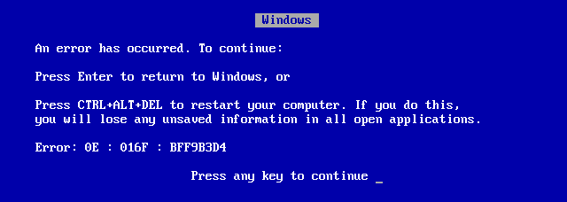
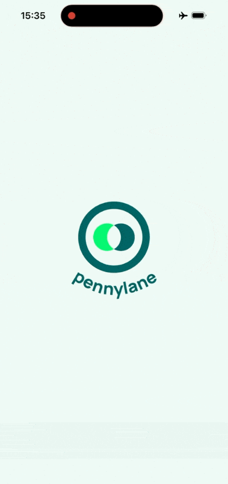
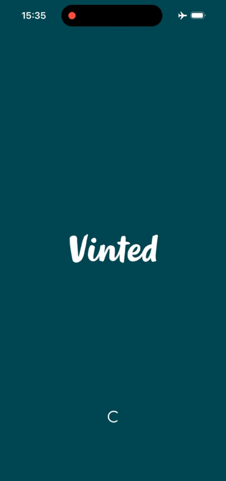
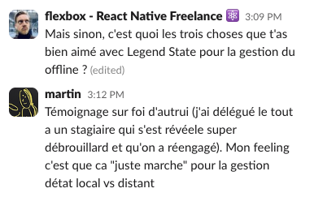

name: inverse
layout: true
class: center, middle, inverse

---

layout: false

# Offline First Mobile Apps

## with React Native & Legend State

📍 reactCon · next.app devCon - Berlin

🗓️ _8 October 2026_

<small class="text-hint">`C` to clone a display; `P` to switch to presenter mode.</small>

???
_00:15_

Guten Tag.

Welcome to "Offline First Mobile Apps with React Native & Legend State"

One idea: the device owns the truth.

---

class: center, bsod

# Who remembers this?

???
_00:40_

Hands up.

Wait for it.

--

### The Blue Screen of Death

.crash-shot[]

--

Microsoft Windows

???

I am officially at the same level as Bill Gates, because I had a blue screen of death on stage.

---

class: center, rrod

# And this one?

???
_00:55_

--

### The Red Ring of Death

.crash-shot[]

--

Microsoft Xbox 360

???
The Red Ring was a hardware failure indicator on the Microsoft Xbox 360.

---

class: center

# And this one?

???
_01:20_

--

### The White Screen of Hell

.phone-shot[]

--

David Leuliette Microsoft MVP

???
As a Microsoft MVP, I have seen my fair share of device failures.

I can officially name the "White Screen of Hell" as one of them.

---

class: center

### Spinners that never stop

.phone-shot[]
.phone-shot[]
.phone-shot[]

???
_01:35_

If you are lucky you will have an infinite spinner

---

# This app didn’t crash

???
_01:45_

--

## It’s waiting for a server it can’t reach

--

It will wait forever.

???

---

### Regional Trains


thanks to[Markus Winkler](https://unsplash.com/photos/silver-and-red-bullet-train-3t3Tk-BYiA4) - Available for hire.

???
The same infinite spinner could arrive when you are on a regional train

---

### DIY Store


thanks to [Tianlei Wu](https://unsplash.com/photos/person-walks-down-aisle-of-stocked-warehouse-shelves-sf6YUxvCoro) - Available for hire.

???
DIY store with the list of items you need to buy to fix your bathroom

on a saturday

with wife and kids running around

---

###  Fancy Bar


thanks to [qui nguyen](https://unsplash.com/photos/empty-chairs-and-tables-inside-lighte-room-cnTdKzMOBns) - Available for hire.

---

### A conference with 6,000 attendees


---

class: scene

## Classic

THE TRUTH LIVES ON THE SERVER · THE PHONE ASKS FOR IT

<object data="./images/offline-first/scene-1-classic.svg" type="image/svg+xml" aria-label="scene-1-classic"></object>

???
_02:15_

Here is a classic situation: like most of the apps in the room.

The truth lives on the server, the phone asks for it,

and when the phone can't ask, it has nothing.

`isPending: forever` is the whole problem in two words.

The server is fine.

The phone is not, and it has no data of its own to fall back on.

---

class: center, middle

> Why don’t we design<br />
> something as seemingly obvious and trivial<br />
> as error messages first?

Vitaly Friedman — co-founder, Smashing Magazine

???
_02:40_

People from Berlin, today I am so happy to give this talk here.

For the ones who don't know, Smashing Magazine is a popular online resource for web designers and developers, from Germany.

That's how I learned my job, by reading Smashing Magazine books.

This quote is basically my whole career.

Why don’t we design error messages first?

Design for failure seems obvious, right?

---

class: center, middle

> Why don’t we design<br />
> something as seemingly obvious and trivial<br />
> as **offline data first**?

David Leuliette

???
_02:55_

Offline is an error state we ship to every user, every day,
and we still design it last.

Thank you Vitaly I will hack your quote and change one word

Why don’t we design offline data first?

---

## We should

???
_03:35_

--

## Because milliseconds matter

???
Offline-first is not a feature for people with no signal.

It is the fastest possible app for everyone, because nothing awaits the network.

--

.phone-shot[]

???
Instagram, first version: the upload started in the background as soon as
you picked a filter.

While you were still writing the caption, the upload was already done.

Tap "Share": instant.

That is the same trick.

Local first, network later.

---

## 10+ years of React state

???
_04:05_

I have been working with React state for over 3 600 days.

--

- `setState`
- Redux
- MobX-State-Tree
- Context API (React 16.3)
- Easy Peasy
- `useState` / `useReducer` (16.8)
- XState
- Zustand
- Redux Toolkit
- React Query
- Jotai

???
Ten years in react, a new state library every time I updated my résumé

Most of them solved client state and treated the network as an afterthought — and the ones that got it right,

we only figured out around 2020.

A problem remained: offline and persistence across app kills

---

## Why Legend State

--

???
_04:30_

The key to building the fastest apps

is to minimize the amount of work that React do.

That means having smaller renders,

and rendering less often.

–Jay Meistrich

In the next session, he will talk about how desktop apps can benefit from the same principles.

in 2022 at `App.js` Catalin Miron pointed me to this library (That's why it's important to come to conferences to meet people and have random conversations).

---

## Why Legend State

### It just works

.it-works[]

???
Even a human can write the code correctly, can you believe that?

The screenshot is in French. Translate it:

I asked to my friend:

"What are the three things you liked about Legend State for offline?"

"Second-hand: I handed it all to an intern, who turned out to be great and we hired him back.
My feeling is that it just works for local vs remote state."

---

## Why Legend State

.legend-shot[<object data="./images/offline-first/scene-state-benchmark.svg" type="image/svg+xml" data-play-on-show aria-label="Legend State benchmark"></object>]

???

The lib is tiny and fast (only `4kb`)

and the persistance layer with the sync engine is built in.

I will not talk about one global state versus multiple atoms because you can do whatever you want.

It's pure JavaScript.

---

# Let's define the observable state

```js
import { observable } from '@legendapp/state';
import { syncedSupabase } from '@legendapp/state/sync-plugins/supabase';
import { ObservablePersistMMKV } from '@legendapp/state/persist-plugins/mmkv';

export const games$ = observable(
  syncedSupabase({
    supabase,
    collection: 'games',
    // Persist data and pending changes locally
    persist: {
      name: 'games',
      plugin: ObservablePersistMMKV,
    },
    // ... 4 more lines are missing
  }),
);
```

???
_05:55_

This is the minimal config.

As you can see I rely on supabase for the remote sync.

But you can use `CRUD` operations with any backend.

I use MMKV for local persistence because it's fast and reliable.

It is deliberately incomplete — 4 lines are
missing and the rest of the talk is those 4 lines.

---

# Reads and writes

```js
const games = useValue(games$);
```

```js
games$[id].title.set('The Legend Of Zelda');
```

???

In Legend State you work with observable functions `get` and `set`,

it lives outside of the react world

The benefit is that you can use it anywhere, notifications, background tasks, tests.

No Provider, no Context.

--

This is the part everyone already gets right.

--

That write works on a plane.

--

It syncs when you land.

--

It is not why your app breaks.

???

**it syncs when you land**.

---

class: scene

## Offline-first · the write

THE TRUTH LIVES ON THE PHONE · THE NETWORK IS NOT INVITED

<object data="./images/offline-first/scene-2-offline-write.svg" type="image/svg+xml" aria-label="scene-2-offline-write"></object>

???
_07:05_

Same drawing as before, flipped: the truth now lives on the phone.

Follow the tap from top to bottom:

1. **The list.** I tick a box. The row re-renders right away, before
   anything is saved. Nothing waits.
2. **The local store** (MMKV). The change is saved on the phone.
   This is now the source of truth, not the server.
3. **The pending queue.** The change also waits here, to be sent later.

On the right, Supabase is grey on purpose: I'm offline. The NO SIGNAL
cross doesn't matter. The app never asked the network for anything.

Key line: "Nothing in this picture waited for the network."

Every choice that follows is about what happens in that queue.

---

# 4 decisions

???
_07:40_

That is the extent of the library pitch.

The rest of the talk is not about Legend State.

It is about the 4 things Legend State can't decide for you.

--

1. Who makes the id?

--

1. How do you delete a row?

--

1. Who wins?

--

1. Does it survive a force-quit?

--

Nobody makes these on purpose.
You inherit them from the defaults.

???
This is the map. Say the four out loud, they are the spine of the talk.
"Every one of these has a default. Every default is wrong for offline."

---

# 1. Who makes the id?

???
_09:10_

--

Offline, there is no server to ask.

--

```js
configureSyncedSupabase({
  generateId: () => uuidv7(),
});
```

--

Your primary key is now a guess made by the client.

- `bigint generated always as identity` — gone
- UUID **v4** is random: it shreds your Postgres index. Use **v7**, it sorts by time
- a client picks its own ids now, so RLS is not optional anymore

--

You can't flip a live table from identity to UUID. That is a migration, with users on it.

???
The last line is the point of the whole talk: this is a one-way door.
Every foreign key, every URL, every analytics event carries the old id.
Decide before the first row, or pay for it with a migration and a maintenance window.

Start with the obvious: you tap "add", you are in a basement, the row needs
a primary key right now. The server is not there to give you one.

The v4 vs v7 point is the one people thank me for afterwards. v4 is random, so
every insert lands on a random B-tree page: page splits, bloated index. v7 is
time-ordered, inserts go to the right-hand edge like a serial does.

The RLS line is the scary one. An id is no longer something the server controls.
A hostile client can send any id it wants, including one that already exists.
Your row-level security policy is the only thing standing there.

---

# 2. How do you delete?

???
_10:40_

--

```js
fieldDeleted: 'deleted',
```

_(you were told to remember this one)_

--

A hard `DELETE` is **invisible** to a device that was offline.

--

A device cannot sync the absence of a row.
It has no way to tell "deleted" from "never existed".

--

So you don't delete. You tombstone 🪦.

--

The rows you already hard-deleted? Gone. No device will ever learn about them.

???
This one breaks people's mental model, so slow down here.

`changesSince: 'last-sync'` asks the server: what changed since Tuesday?
Postgres answers with rows. A deleted row is not a row. It is nothing.
And nothing is exactly what an empty response looks like.

So the row stays, with a `deleted` boolean, and it syncs like any other change.
The tombstone IS the message.

---

# 2. How do you delete?

## What it costs

???
_11:55_

--

- Rows never actually leave. You need a reaper job.

--

- Every query, every view, every RLS policy filters `deleted = false`.
  Forget once and deleted data reappears in a list.

--

- "Delete my account" now means two different things.
  Your GDPR erasure path is **not** `fieldDeleted`.

???
Berlin audience: the GDPR line lands. Do not rush it.

Soft delete is a sync primitive. It is not a legal delete.
The day someone exercises Article 17 you need a real `DELETE` that also tells
every device the row is gone — and a tombstone is the only way to tell them,
so you keep a stub with the payload stripped.

If I get one question after this talk, it is this one.

---

# 3. Who wins?

???
_13:40_

--

Two devices. Same row. Both offline.

--

Nothing detects anything. **Last write wins.**

--

And by default Legend State sends the **whole object**:

--

```js
updatePartial: true, // send only the fields that changed
```

--

Without it, device B reverts a field it never touched.

--

And "last" is decided by `updated_at`. **The phone never writes that column.**
A Postgres trigger does.

???
The clock line: `changesSince: 'last-sync'` and last-write-wins both read
`updated_at`. If the device stamps it, you are trusting a clock the user can
set by hand, that drifts, that crosses time zones. Server trigger, always.
This is a schema decision, not a config flag.

The honest framing: Legend State has no conflict resolution. It does not
pretend to. It is a sync engine, not a CRDT.

`updatePartial` defaults to false, so an update ships the full row. Two people,
same row, different fields, both offline: the second one to reconnect writes
all of its fields over all of yours. Your edit is gone and nobody saw an error.

`updatePartial: true` narrows the blast radius to the fields that actually
changed. It is still last-write-wins. It is just last-write-wins on one field
instead of twelve.

---

# 3. Who wins?

## So don't put these in the sync layer

???
_14:40_

--

- Counters and stock levels — `n = n + 1` is not a value, it's an operation
- Anything two people edit at once — that is a CRDT's job
- Money

--

Move the contested value to the server.
Let the device own everything else.

???
The real trade-off slide, and the most useful thing I can tell you.

Offline-first is not "everything offline". It is "everything offline
**except** the things where being wrong is expensive". Inventory, balances,
seat reservations: those stay server-authoritative, and the UI is allowed
to show a spinner for them.

One spinner in the whole app, on purpose, is a design decision.
Forty accidental ones is a bug.

---

# 4. Does it survive?

???
_15:05_

--

> "It syncs when you land."
>
> — me, eight minutes ago

--

Not with the config I showed you.

???
Own it. The callback is the point — let it sit for a beat.

Pending changes live in memory. Airplane mode, tap, swipe up, kill the app:
the write never existed. This is the bug that shipped to production for me.

---

# 4. Does it survive?

```js
persist: {
  name: 'games',
  plugin: ObservablePersistMMKV,
  retrySync: true,   // pending changes go to MMKV, not just memory
},
retry: {
  infinite: true,    // keep retrying until it saves
},
```

???
_16:20_

--

**The trap:** a change the server will _never_ accept
— RLS reject, deleted parent row — retries forever.

--

Infinite retry needs a poison-pill escape hatch.

???
`retrySync` is two words that separate a demo from a product.

Then the honest part: `infinite: true` means infinite. I have watched a queue
retry the same rejected insert for days because the parent row was gone. The
device is offline-first and also permanently wrong, quietly, forever.

Count the retries, and after N failures surface it or drop it — but decide
which. Silence is the one option that is always wrong.

---

class: scene

## Reconciliation

SIGNAL RETURNS · THE QUEUE DRAINS · A DELTA COMES BACK

<object data="./images/offline-first/scene-3-reconciliation.svg" type="image/svg+xml" aria-label="scene-3-reconciliation"></object>

???
_16:50_

Say it, don't show it: "A change the server will never accept retries forever. Count the failures, then decide."

On screen (Reconciliation):

- API
- POSTGRES
- UPSERTS, OLDEST FIRST
- ids came from the phone, so a retry is idempotent
- DELTA SINCE last_sync
- changed rows + tombstones (deleted: true)
- a hard DELETE would have arrived as nothing
- LOCAL STORE · STILL THE TRUTH
- server rows merge in per field
- last write wins, updatePartial: true
- DURABLE REPLICA

Signal is back. Read the arrows once, left to right: the queue drains
as upserts, ids came from the phone so retries are safe. A delta comes back
with tombstones. Fields merge, last write wins. That is the four decisions
drawn as one picture. Next slide is the same thing as code.

---

# The whole thing

```js
configureSyncedSupabase({ generateId: () => uuidv7() }); // 1

export const games$ = observable(
  syncedSupabase({
    supabase,
    collection: 'games',
    changesSince: 'last-sync',
    fieldUpdatedAt: 'updated_at',
    fieldDeleted: 'deleted', // 2
    updatePartial: true, // 3
    persist: {
      name: 'games',
      plugin: ObservablePersistMMKV,
      retrySync: true, // 4
    },
    retry: { infinite: true }, // 4
  }),
);
```

???
_17:40_

--

Four lines more than the minimal config. That is the whole talk.

???
Don't read it. Point at the four numbers, name each decision once.

"Ids. Deletes. Conflicts. Retries. Four lines. Everything else was already
in the minimal config."

---

# The trade-offs

???
_18:40_

--

- You now run a **distributed system**. Two sources of truth, permanently.

--

- Bugs reproduce on one device, in one sync state.
  Build a "dump the local store" screen on **day one**.

--

- Read-mostly app? You don't need this. React Query plus a persister is enough.

--

- Two people editing the same text? You don't need this either. You need a CRDT.

???
This is where the abstract's "hard-won" claim gets paid.

The store-dump screen is not optional. The first bug report you get will be
"it works on my phone". You need to see their queue, their last-sync, their
tombstones. If you can't, you are debugging blind.

Then the honest part: most apps in this room are read-mostly. A feed with a
like button does not need a sync engine. Cache it, persist the cache, ship.
And if it is Google Docs, this is the wrong tool. LWW is not a merge.

---

class: scene

## Airplane mode

SAME APP · SAME BASEMENT · THE TRUTH IS ALREADY ON THE PHONE

<object data="./images/offline-first/scene-4-airplane-mode.svg" type="image/svg+xml" aria-label="scene-4-airplane-mode"></object>

???
_19:05_

Say it, don't show it: "No spinner. No error screen. Two changes waiting for a signal that can take its time."

On screen (Airplane mode: same app, it just works):

- deleted: true
- SWIPE UP · KILLED
- AIRPLANE MODE
- no signal, on purpose
- ADD · RE-RENDERED AT ~0 MS
- no spinner, nothing awaited
- DELETE · TOMBSTONE
- the row stays, flagged
- PENDING QUEUE
- on disk · retrySync: true
- FORCE-QUIT · REOPEN
- still there. all of it.
- API
- POSTGRES
- NO SIGNAL

Callback to the three spinners from the open. Don't narrate it, it
loops every 12 seconds: add, delete, force-quit, reopen, still there.
Let it run twice. Then the one line: no spinner, no error screen.

---

class: center, middle

# The device owns the truth

???
_19:25_

--

The server is just the **other** device — the one that syncs slowest.

???
This is the takeaway. Say it, stop talking, let it land.

If they remember one sentence from twenty minutes, it is this one.

---

## Your mission today

???
_19:50_

--

- Open your app. Turn on airplane mode. Tap something. **Today.**

--

- Identify the "White Screens of Hell" in your app and fix them.

--

- Talk to random people about how their app behaves offline and make new friends.

--

- Because milliseconds matter — and so does the basement of a
  DIY store with no signal.

???

---

# David Leuliette

Mobile Engineer @ sunday

`@flexbox_`

Slides: [**davidl.fr/courses/offline-first.html**](https://davidl.fr/courses)

French React Native podcast: [**Le Cross Platform Show**](https://weshipit.today/podcast)

???
_20:00_

I am David aka `@flexbox_` on the internet.

That was my talk.

Thank you.
