name: inverse
layout: true
class: center, middle, inverse

---

layout: false

<!-- Feedback -->
<!-- Add illustrations -->

# Universal Application with React Native

📍 Chain React — Portland

🗓️ _July 2024_

???
Thanks for having me at Chain React

---


???
To come to the conference, I took the subway and saw many people looking at their phones.

---

Daily time spent online by device

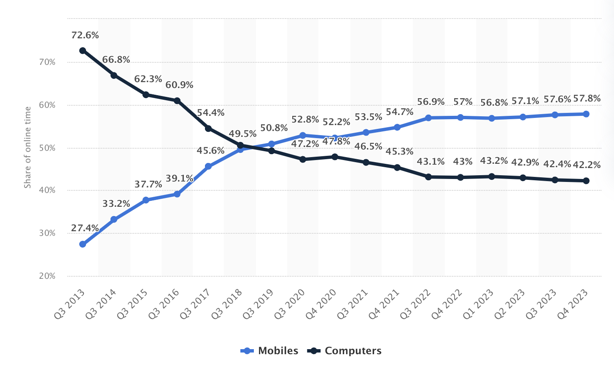

_source [statista](https://www.statista.com/statistics/319732/daily-time-spent-online-device/)_

???
people always have their phones with them and already spend more time on their phones than on their computers.

next year it will be 60% on mobile and 40% on desktop

---

> 90% of their mobile time is spent in apps, and only 10% browsing the rest of the internet.

???
we spend less time on the web and more time in apps

---

<blockquote class="twitter-tweet" data-media-max-width="560"><p lang="en" dir="ltr">Believe it or not, there was a news article in there somewhere 😂 - this is why mobile users prefer apps over mobile web! <a href="https://t.co/R7uawqJWb5">pic.twitter.com/R7uawqJWb5</a></p>&mdash; Kadi Kraman 💚 (@kadikraman) <a href="https://twitter.com/kadikraman/status/1808506298608099609?ref_src=twsrc%5Etfw">July 3, 2024</a></blockquote>

???
kadikraman have the answer on why

---

# People want apps

---

# People want apps that work everywhere,

---

# People want apps that work everywhere, with native and web feature parity

---

# People want apps that work everywhere, with native and web feature parity, and that spark joy. ✨

???
Example:

- Shine a banking app for freelance

- Netflix `web`, `iOS`, `tvOS`

- What does beta.gouv.fr do for the tax app?

---

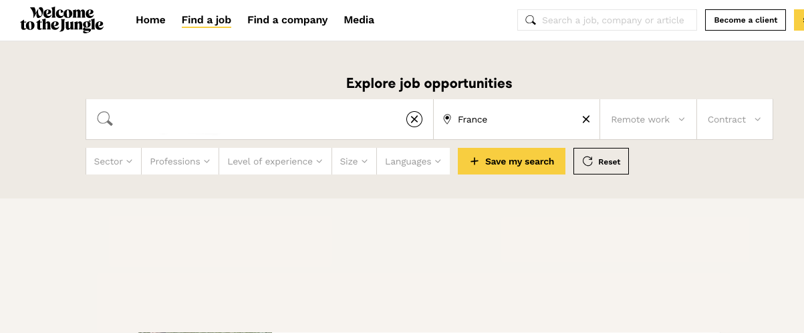

???
The weird think is that tech continues to make web apps

---

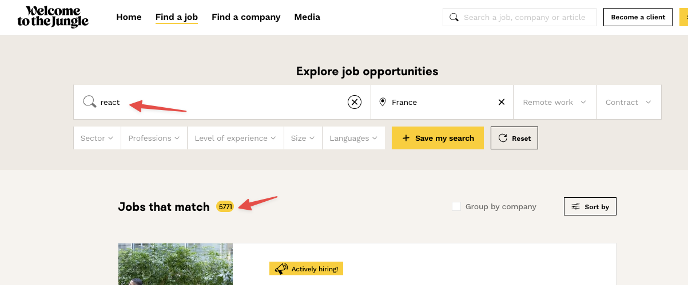

---

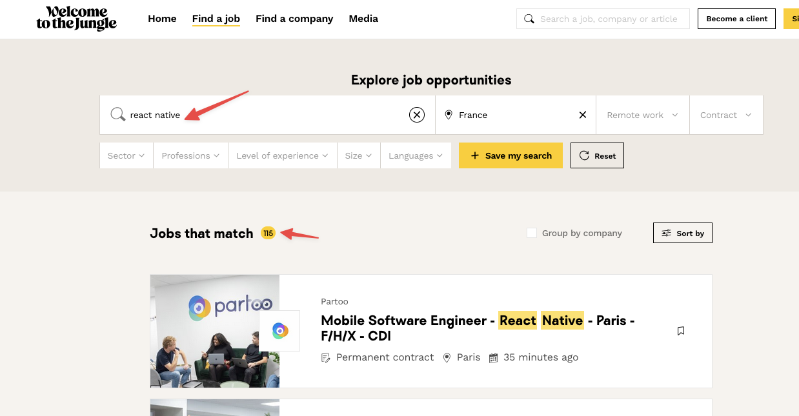

---

# Universal Apps

???
Tech people and developers want a single codebase that works everywhere.

Business people starts to see the value in a single codebase.

Hiring is easiser.

--

1. `react-native`

--

1. `react-native-web`

--

1. Profit 🍹

---

# Universal Apps


---

# Universal Apps === Meta Framework

👋 [@axeldelafosse](https://twitter.com/axeldelafosse)

---

# Universal Apps === Meta Framework

1. `react-native`

--

1. `react-native-web`

--

1. `expo`

--

1. `nextjs`

--

1. `react-navigation`

--

1. `solito`

--

1. `yarn-workspaces`

--

1. JavaScript Dependencies

--

1. Native Dependencies

--

1. Module transpilation

--

1. ...

--

1. the list can go forever

???
Screen is too small for all the requirements

---

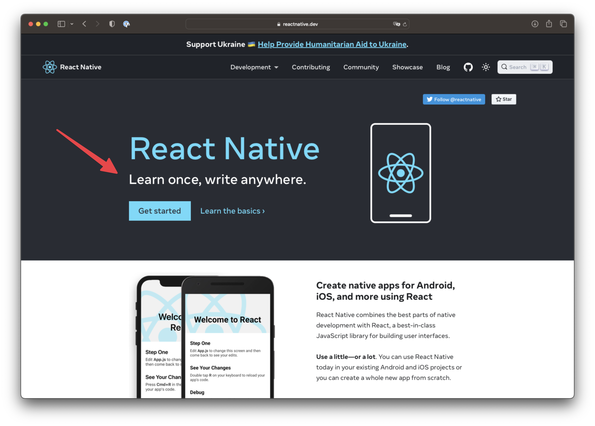

???
only react-native, is not enough.

learn once, write anywhere. is a great starting point but we have some missing parts.

---

# Universal Apps

???
On a universal app context we need more tools to be productive

--

- "Ruby on Rails DX" —**unified routing**, **code generation**

--

- with `expo` and `expo application services`

--

- **Feature parity** that adapts on each platform

--

- Write **styles** that output to platform primitives

--

- 👉 [tamagui.dev](https://tamagui.dev)

---

class: no-padding

<iframe src="https://tamagui.dev" width="100%" height="100%" frameborder="0" />

---

## /whois

### David Leuliette

.remark-avatar[]

???
Who is CTO here? can you raise your hands?

I do react native freelance as freelance, so we should talk

@flexbox on slack

--

🚀 React Native Freelance [weshipit.today](https://weshipit.today/)

--

💬 [`@flexbox` on Slack](https://community.infinite.red/)

---

# Mentions 💙 [@flexbox\_](https://twitter.com/flexbox_)

???
For internet people who will catch up with VOD and have more questions

--

# Slides [davidl.fr/courses](https://davidl.fr/courses)

---

## Today we will be covering

- Why Tamagui?
- What is Tamagui?
- Navigation
- Starter kit exploration
- Demo

---

## Why Tamagui?

--

👋 [@natebirdman](https://twitter.com/natebirdman)

---

### The Frontend Trilemma


???
Let's take back our banking app example for freelance

---

### The Frontend Trilemma

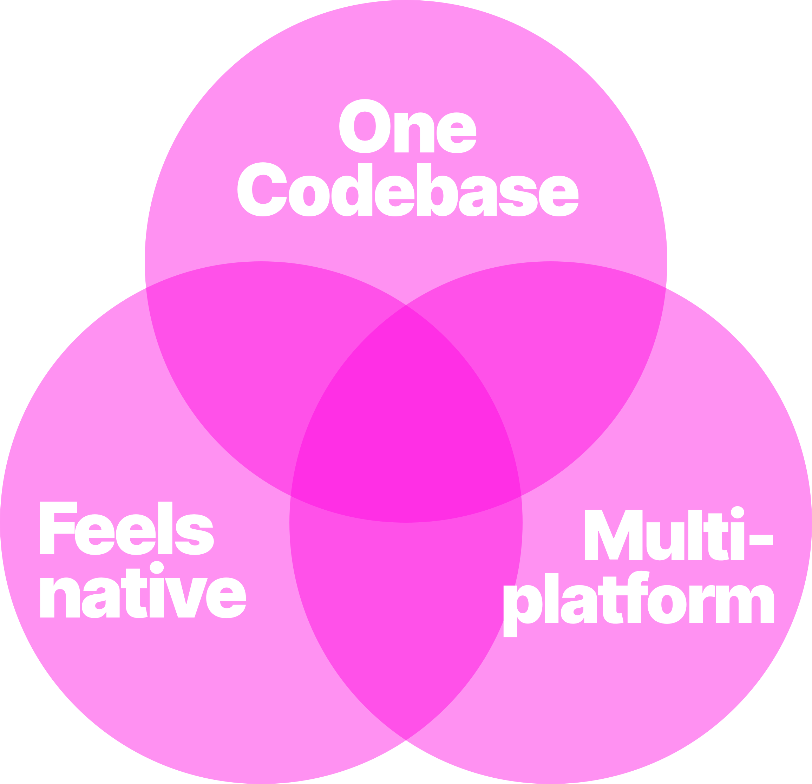

---

### The Frontend Trilemma

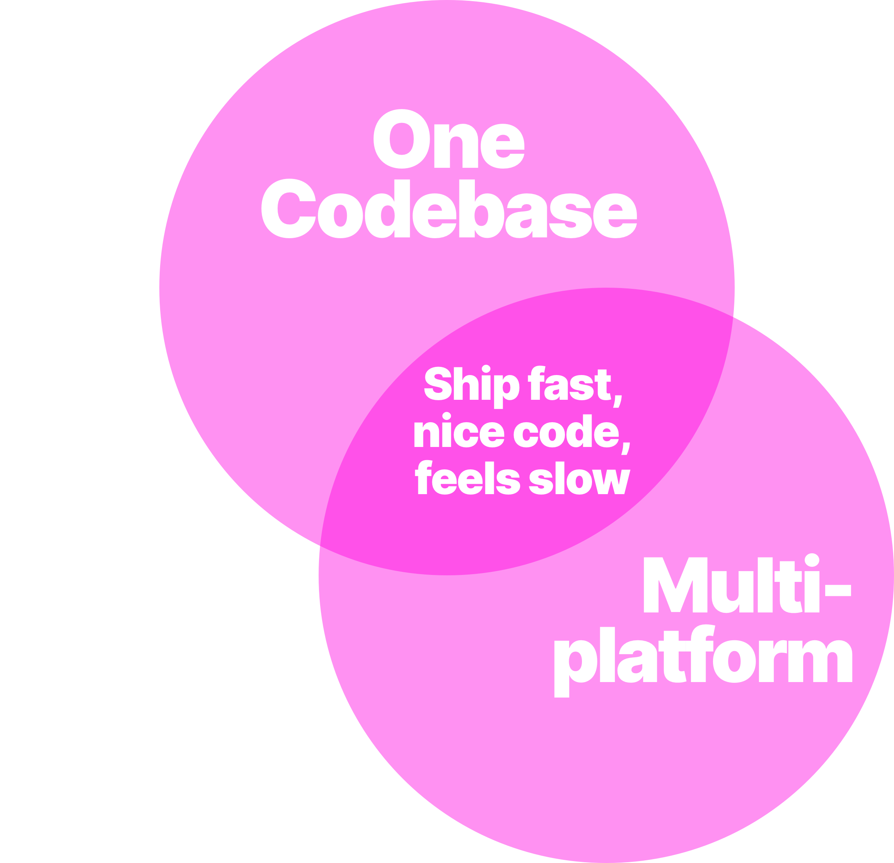

---

### The Frontend Trilemma

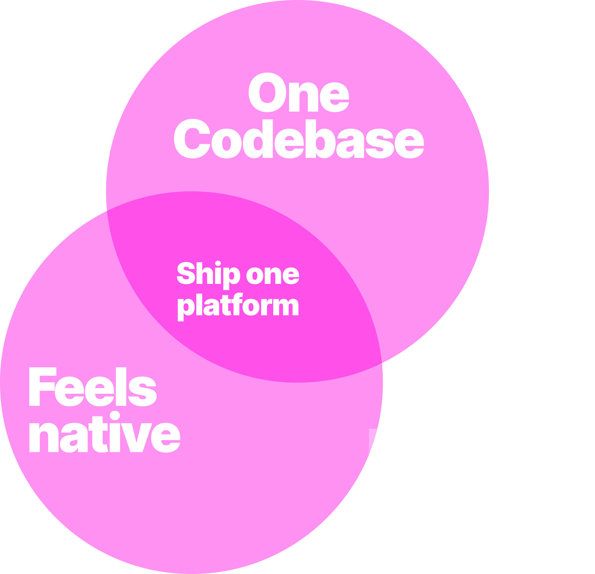

---

### The Frontend Trilemma

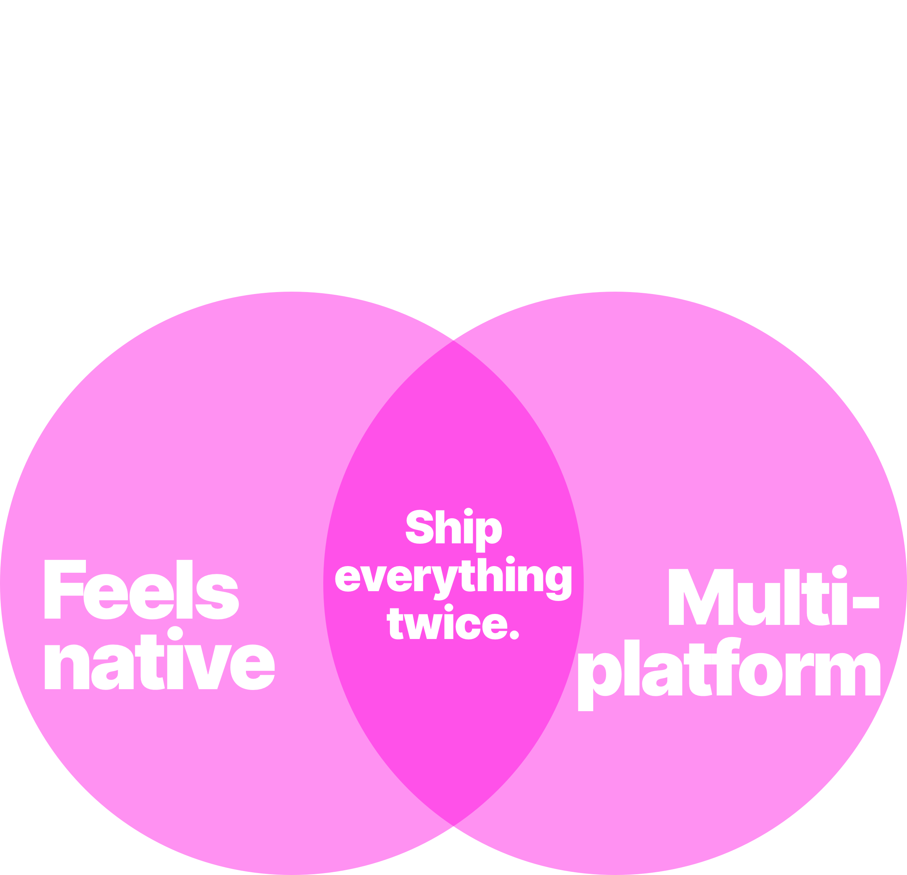

---

### The Frontend Trilemma

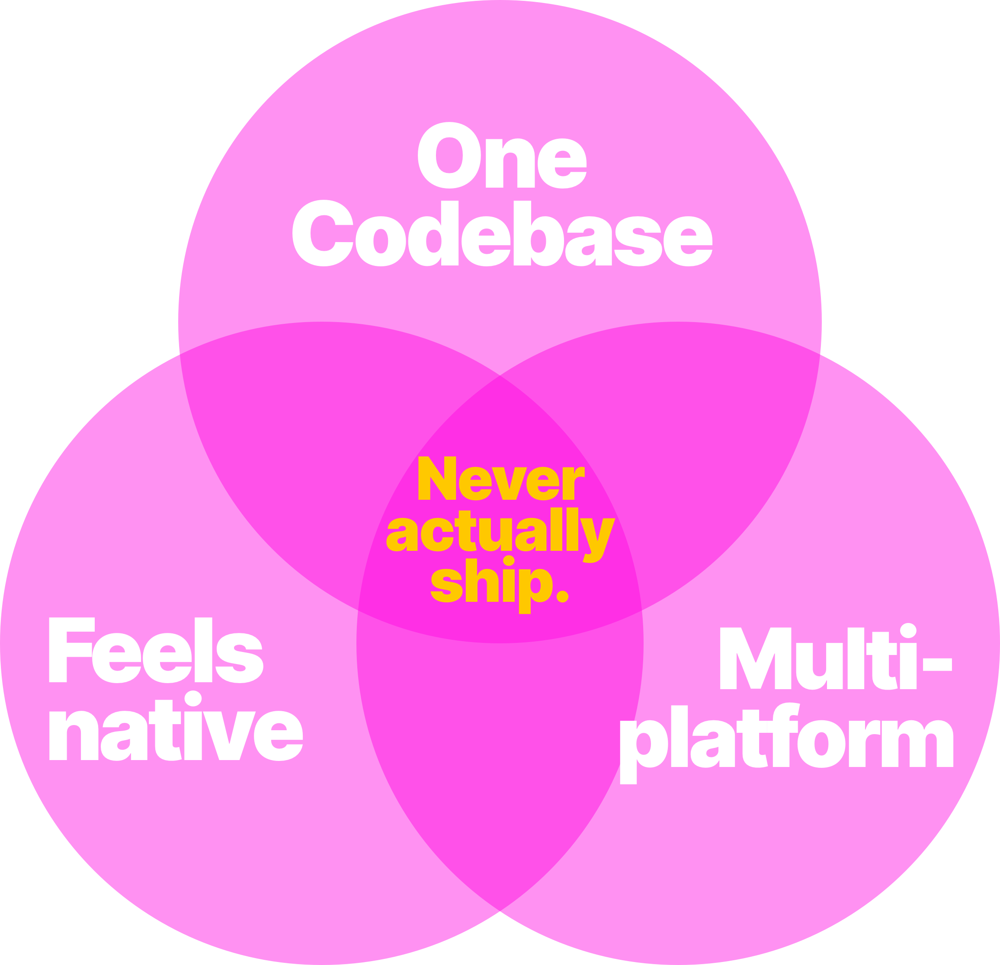

---

### The Frontend Trilemma


--

[why-a-compiler](https://tamagui.dev/docs/intro/why-a-compiler)

---

### Performance is complex

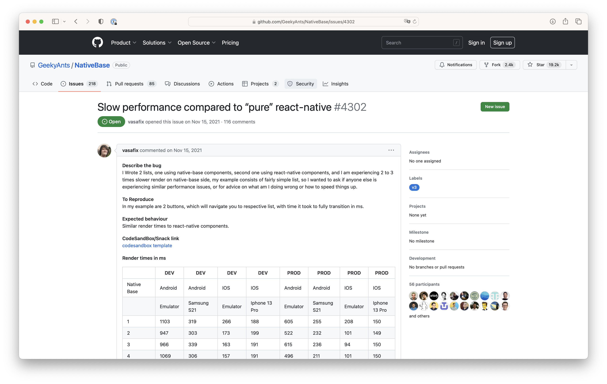

--

[GeekyAnts/NativeBase/issues/4302](https://github.com/GeekyAnts/NativeBase/issues/4302)

???
we use hooks for media queries and themes, which basically touch every component.

This causes whole-tree re-renders and more expensive main-thread time in critical areas on the web.

---

### Fixing Performance issues

???
Notre Ami @natebirdman a mis en place 2 choses

--

- 🗜️ compiler

--

- ✨ optimisations

--

#### React Native

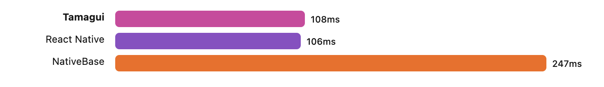

--

#### Web

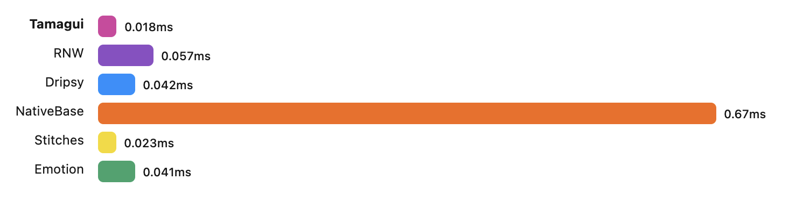

???

<!-- TODO add text for benchmark -->

---

### Tamagui

--

1. **Fast responsive** styles

--

1. Universal themes, generated at **build time**

--

1. Universal applications

--

- **Monorepo**

--

- **Navigation**

---

## What is Tamagui?

---

### @tamagui/core 🎨

--

### @tamagui/static 🗜️

--

### Universal UI Kit 🧑‍🎨

---

### @tamagui/core 🎨

???
For people who are familiar it's the same as

- React > themeUI
- React Native > restyle

You access tokens by using `$` prefixes in your values.

--

```javascript
import { Text } from '@tamagui/core';

const App = () => (
  <Text fontSize="$lg" fontFamily="$mono" color="$white">
    Hello world
  </Text>
);
```

---

### @tamagui/core 🎨

Create a **new `Circle` component** by extending an existing one `Stack`

--

```javascript
import { GetProps, Stack, styled } from '@tamagui/core';

export const Circle = styled(Stack, {
  name: 'Circle', // useful for debugging, and Component themes
  borderRadius: 100_000_000
});
// helper to get props for any TamaguiComponent

export type CircleProps = GetProps<typeof Circle>;
```

???
Inline styles and `styled()` both are optimized by the compiler

---

### @tamagui/core 🎨

Usage

```javascript
<Circle x={10} y={10} backgroundColor="red" />
```

[`styled()` docs](https://tamagui.dev/docs/core/styled)

???
fast primitives for inline styles as well as hooks - even for media queries and themes - that work the same on native as they do web.

The styled() function supports Tamagui views, React Native views, and any other React component that accepts a style prop.

When using `styled` or any Tamagui component like `Stack`, you can access tokens directly.

---

#### @tamagui/themes

--

Create design token

```javascript
const tokens = createTokens({
  color: {
    black: '#111',
    white: '#fff',
  },
});
```

---

#### @tamagui/themes

Then, you can use them in any theme

--

```javascript
const light = createTheme({
  background: tokens.color.white,
  color: tokens.color.black,
});
```

--

```javascript
const dark = createTheme({
  background: tokens.color.black,
  color: tokens.color.white,
});
```

[theme docs](https://tamagui.dev/docs/intro/themes)

---

#### @tamagui/themes

[custom theme generation](https://github.com/tamagui/tamagui/blob/master/packages/config-base/src/tamagui.config.ts)

???
Pour votre typograghy scale de la muerte

---

#### [Lucide Icon](https://tamagui.dev/docs/components/lucide-icons/1.0.0)

???
The great Lucide Icons, a superset of the wonderful Feather Icons.

https://lucide.dev/

https://feathericons.com/

--

```javascript
import { Button } from 'tamagui';
import { Plus } from '@tamagui/lucide-icons';
```

--
Button will automatically pass size/theme to icon

```javascript
export default () => <Button icon={Plus}>Hello world</Button>;
```

--

or you can control it

```javascript
export default () => <Button icon={<Plus size="$4" />}>Hello world</Button>;
```

---

#### Animations

--

- CSS
- Animated
- Reanimated

???
They're implemented as pluggable drivers, starting with two:

- CSS
- Animated
- Reanimated

Which means you can swap entire animation drivers depending on your platform

---

#### Animations

```console
yarn add @tamagui/animations-moti react-native-reanimated
```

--

```javascript
import { createAnimations } from '@tamagui/animations-reanimated';
import { createTamagui } from 'tamagui';

export default createTamagui({
  animations: createAnimations({
    fast: {
      type: 'spring',
      damping: 20,
      mass: 1.2,
      stiffness: 250,
    },
  }),
  // ...
});
```

[tamagui reanimated doc](https://tamagui.dev/docs/core/animations#reanimated)

---

### @tamagui/static

--

An optimizing compiler `@tamagui/static` for incredible performance.

--

- Extracts all types of styling syntax into atomic CSS.

--

- Removes a high % of inline styles with partial evaluation and hoisting.

--

- Reduces tree depth, flattening expensive styled components into `div` or `View`.

--

- Evaluates `useMedia` and `useTheme` hooks, turning logical expressions into **media queries** and **CSS variables**.

---

### Universal UI Kit

--

tamagui is a **batteries-included UI Kit** that builds on core with easy-to-use universal components.

--

- [Stacks](https://tamagui.dev/docs/components/stacks)
- [Inputs](https://tamagui.dev/docs/components/inputs)
- [Label](https://tamagui.dev/docs/components/label)
- [Switch](https://tamagui.dev/docs/components/switch)
- [Button](https://tamagui.dev/docs/components/button)
- [Separator](https://tamagui.dev/docs/components/separator)
- [Popover](https://tamagui.dev/docs/components/popover)
- [Tooltip](https://tamagui.dev/docs/components/tooltip)
- [Square and Circle](https://tamagui.dev/docs/components/square)
- [HTML Elements](https://tamagui.dev/docs/components/html-elements)
- ...

---

## Navigation

---


---

> web's URL mental model to get around screens, rather than screen names

---

## Navigation

--

```console
npm create tamagui@latest
```

--

📦 Included packages in the monorepo

- Expo SDK

--

- Next.js

--

- `tamagui` for cross-platform themes and animations

--

- **React Navigation 6**

--

- **`solito` for cross-platform navigation**

---

### [Solito](https://solito.dev/)

???
Can you raise your hand if you know solito ?

--

[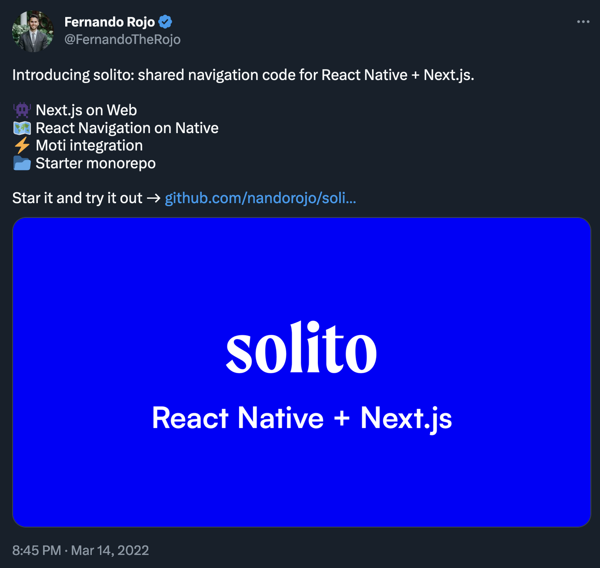](https://twitter.com/FernandoTheRojo/status/1503457235929862154)

---

#### [useRouter](https://solito.dev/usage/use-router)

--

```javascript
import { useRouter } from 'solito/router';

const { push, back } = useRouter();
const onPress = () => {
  push('/');
};
const onGoBack = () => {
  back();
};
```

---

#### [Link](https://solito.dev/usage/link)

--

```javascript
// 🚨 this is bad, it uses Pressable
<Link href="/">
  <Pressable />
</Link>
```

--

```javascript
// ✅ this is good, it uses a View
<Link href="/">
  <View />
</Link>
```

???
Children recommendation

You shouldn't render a Pressable or Touchable as a child of a Link component.

Doing so can mess with the press events on Web and cause issues with next/router.

---

#### [useLink](https://solito.dev/usage/use-link) in Tamagui

--

```javascript
const linkProps = useLink({
  href: '/user/nate',
})

<Button {...linkProps}>Link to user</Button>
```

???
pareil que `navigation.navigate("ScreenName")`

---

#### [useParam](https://solito.dev/usage/params)

--

.row[

.left-column[

with React Navigation

```javascript
import { useRoute } from '@react-navigation/native';

const useUsername = () => {
  const route = useRoute();
  const username = route.params?.username;
  return username;
};
```

with Next.js

```javascript
import { useRouter } from 'next/router';

const useUsername = () => {
  const router = useRouter();
  const username = router?.query.username;
  return username;
};
```

]

.right-column[

with Solito

```javascript
import { createParam } from 'solito';

const { useParam } = createParam();

export const useUsername = () => {
  const [username] = useParam('username');
  return username;
};
```

]
]

???
useParam is a hook that lets you read screen parameters on both Next.js and React Native.

On Native, it reads React Navigation params, and on Web, it reads query params from next/router.

---

### Expo Router?

--

📁 file-system based routing in native apps

???
File-based router for React Native apps

--

[https://solito.dev/expo-router](https://solito.dev/expo-router)

---

## Monorepo architecture exploration

--


---

# DEMO TIME

netflax

- [Codebase GitHub](https://github.com/flexbox/react-native-bootcamp/tree/main/hackathon/netflax)
- [Youtube playlist](https://www.youtube.com/playlist?list=PLmewDYeBL3XJux-ckC6NLW3XfvwBA_eBR)

---

## Q&A [@flexbox\_](https://twitter.com/flexbox_)

--

[flexbox.gumroad.com/l/expo-checklist](https://flexbox.gumroad.com/l/expo-checklist/)


???

In this talk, what parts were **the hardest to understand**?
